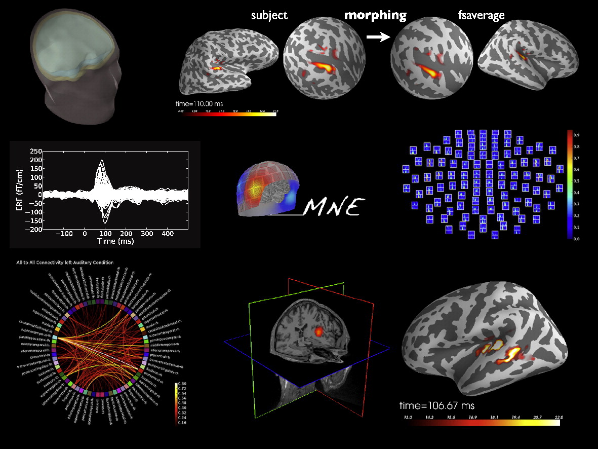
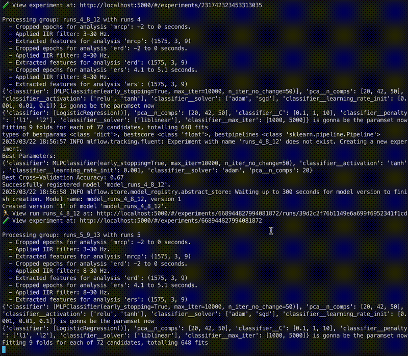
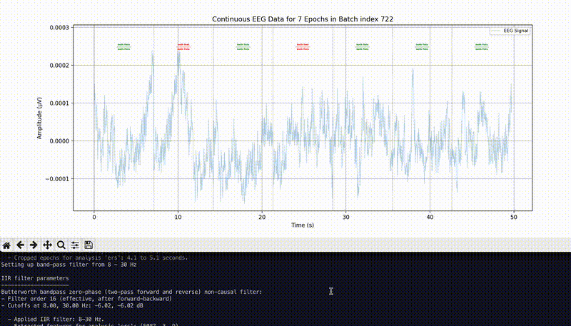
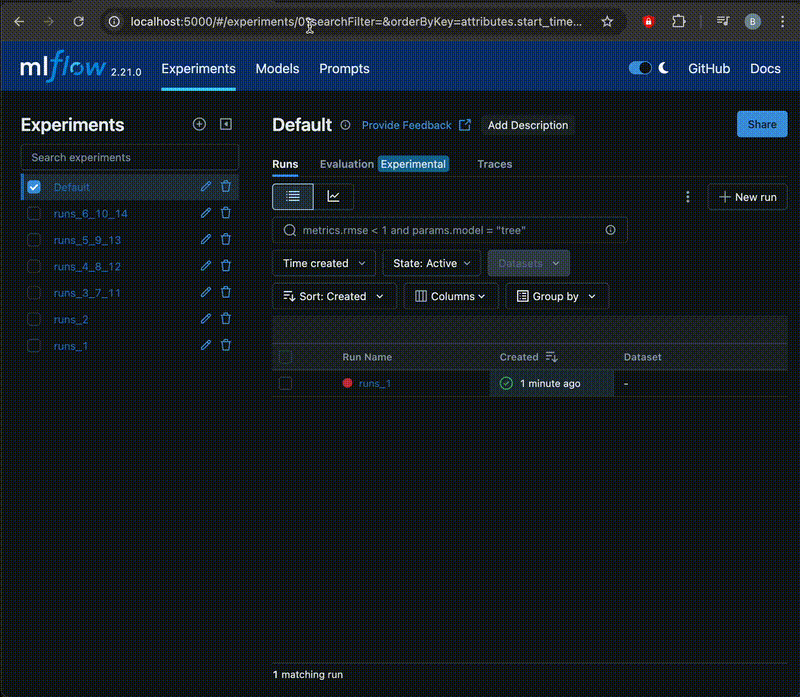

<!-- Improved compatibility of back to top link: See: https://github.com/othneildrew/Best-README-Template/pull/73 -->
<a id="readme-top"></a>

<br />
<div align="center">
  <a href="https://github.com/your_username/total_perspective_vortex">
    
  </a>

  <h3 align="center">Total Perspective Vortex</h3>
  <p align="center">
    <strong>EEG Motor Imagery Classification with Machine Learning</strong>
  </p>

  <p align="center">
    Dive into a streamlined, powerful pipeline for EEG motor imagery tasks. The tool harnesses the strengths of 
    <em>Python, scikit-learn, MNE, and MLflow</em> 
    to deliver a flexible solution for both researchers and enthusiasts.
  </p>

  
</div>

---

<!-- ABOUT THE PROJECT -->
## About The Project

In this repository, you'll find a robust toolkit for EEG motor imagery tasks—perfect for BCI research and development. Powered by Python, MNE, and scikit-learn, it provides functionality for signal filtering, feature extraction, dimensionality reduction (PCA), and classification. With MLflow integration for streamlined experiment tracking and reproducibility, this resource helps you confidently explore new approaches in EEG data analysis.

<p align="right">(<a href="#readme-top">back to top</a>)</p>

---

<!-- BUILT WITH -->
## Built With

- [Python](https://www.python.org/)
- [scikit-learn](https://scikit-learn.org/)
- [MLflow](https://mlflow.org/)
- [MNE](https://mne.tools/stable/index.html)


<p align="right">(<a href="#readme-top">back to top</a>)</p>

---

<!-- GETTING STARTED -->
## Getting Started

Follow these instructions to set up the project locally.

### Installation

1. **Clone the repository:**
   ```bash
   git clone https://github.com/alexdrumi/total_perspective_vortex.git
   cd total_perspective_vortex

2. **Setup the environment:**
   ```bash
   source ./setup_environment.sh

3. **Download EEG Motor Movement Data: Manually download the dataset from:**
   https://physionet.org/static/published-projects/eegmmidb/eeg-motor-movementimagery-dataset-1.0.0.zip


4. **Unzip the downloaded EEG data. Place all the files into the data folder as shown below.**
   ```bash
   data
   ├── 64_channel_sharbrough-old.png
   ├── 64_channel_sharbrough.pdf
   ├── 64_channel_sharbrough.png
   ├── SHA256SUMS.txt
   ├── data.sh
   ├── wfdbcal
   ├── ANNOTATORS
   ├── RECORDS
   ├── S001
   ├── S002
   └── ... (S003 to S109)
   ----------------------------------
   .
   ├── cleanup_environment.sh
   ├── config
   ├── data
   ├── logs
   ├── models
   ├── requirements.txt
   ├── setup_environment.sh
   ├── src
   ├── venv
   └── assets  
<p align="right">(<a href="#readme-top">back to top</a>)</p>

<!-- USAGE -->
5. **Train your model:**
   ```bash
   cd src/main_app
   python train_bci.py

6. **Enable MLFLOW (optional):**
   ```bash
   cd src/main_app
   python train_bci.py --mlflow=true

7. **Make predictions:**
   ```bash
   cd src/main_app
   python predict_bci.py

8. **Make predictions with EEG plot (optional):**
   ```bash
   cd src/main_app
   python predict_bci.py --plot_eeg_predictions=true

<p align="right">(<a href="#readme-top">back to top</a>)</p>

## Media

This project includes demo GIFs and screenshots to showcase its functionality. All media files are stored in the `assets` folder.

**Demo GIFs:**

- **Training Process:**  
  

- **Prediction Process:**  
  

- **MLFLOW Overview:**  
  


   
